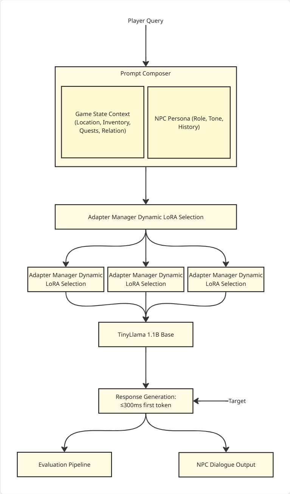

# Domain-Adaptive Lightweight NPC AI Framework
### LoRA-Adapted TinyLlama for Persona-Stable, Runtime-Switchable Game NPC Dialogue

> **Final Year Research Project** · IEEE Conference on Games (CoG) Track
> Department of Computer Science

---

## Overview

NPC dialogue systems fall into two failure modes: large cloud-hosted models (GPT-4o, Claude) give good quality but are too slow, expensive, and offline-incompatible for consumer game hardware; scripted dialogue trees are fast and cheap but brittle — any input outside the script collapses the persona immediately.

This project builds a framework around one shared **TinyLlama 1.1B** base model with multiple **LoRA domain adapters** — one per NPC archetype — swapped at runtime with no full model reload. Medieval RPG NPC dialogue is the primary research domain; healthcare and education adapters are trained as secondary domains to demonstrate generalizability.

Full specification, schema, and roadmap: [`DevFiles/Specs.md`](DevFiles/Specs.md). Task tracking: [`Docs/TODO.md`](Docs/TODO.md). Data pipeline docs: [`Docs/DATA_PIPELINE.md`](Docs/DATA_PIPELINE.md).

---

## Research Contributions

| # | Contribution | Type |
|---|--------------|------|
| 1 | **Persona Drift Metric (PDM)** — quantifies how much an NPC's dialect/voice degrades across a multi-turn conversation (Jaccard similarity of archaic-feature sets per turn vs. a reference set) | Novel metric |
| 2 | **Adapter blending for mixed-persona NPCs** — interpolating two LoRA weight matrices (`W_blend = α·W_A + (1-α)·W_B`) to produce coherent hybrid personas (e.g. scholar-guard) | Novel technique |
| 3 | **Medieval NPC dialogue dataset** — archetype-, intent-, and dialect-annotated dialogue pairs from hand-authored, Gutenberg-extracted, and LLM-augmented sources | Dataset |
| 4 | **Lightweight framework + benchmarks** — 1.1B model + LoRA adapters vs. GPT-4o few-shot and full fine-tune, on persona consistency, latency, and memory footprint | Systems |

## Research Questions

| ID | Question |
|----|----------|
| RQ1 | Can LoRA-adapted lightweight models achieve persona consistency comparable to large models at a fraction of inference cost? |
| RQ2 | Does adapter blending produce coherent mixed-persona outputs, and how does blend ratio affect perceived character identity? |
| RQ3 | How does persona drift change across multi-turn NPC dialogues, and how does fine-tuning reduce it? |
| RQ4 | Can runtime adapter switching maintain real-time performance (<200ms) suitable for interactive games? |

---

## Domains

| Domain | Role | Notes |
|--------|------|-------|
| **Medieval RPG NPCs** *(primary)* | Guard, merchant, scholar, noble, innkeeper, herbalist, clergy, peasant | All novel contributions (PDM, blending) are designed and validated here |
| **Healthcare QA** *(secondary)* | Patient-facing assistant persona | Demonstrates framework generalizability; MedQuAD-derived dataset |
| **Education / CS Tutoring** *(secondary)* | Tutoring assistant persona | Demonstrates framework generalizability |

---

## Architecture



```
Player input ──▶ FastAPI backend ──▶ Domain Detector / Adapter Manager
                                              │
                          TinyLlama 1.1B base (always loaded)
                                    + swapped/blended LoRA adapter
                                              │
                          PDM Scorer · BERTScore · Latency Logger
```

Request flow, adapter blending flow, and full component breakdown: see `Specs.md` section 4.

---

## Evaluation

Four comparison conditions measured per metric:

| Condition | Description |
|-----------|-------------|
| A | TinyLlama, no adapter (baseline floor) |
| B | TinyLlama + Medieval LoRA (primary claim) |
| C | GPT-4o few-shot, 5 examples (upper bound reference) |
| D | TinyLlama full fine-tune (cost comparison) |

| Metric | Tool |
|--------|------|
| PDM (Persona Drift Metric) | Custom Python (`Specs.md` Appendix A) |
| BERTScore F1 | `bert-score` |
| Response latency | Python `time` |
| Peak RAM | `psutil` |
| Adapter storage | `os.path.getsize()` |

Plus a human evaluation protocol (20–30 participants, blind Likert rubric, Cohen's Kappa target κ > 0.6) and a 50-conversation persona stress test corpus (identity challenges, out-of-world references, modern-language probes, extended-pressure conversations). Full protocol: `Specs.md` section 8.

---

## Tech Stack

| Layer | Tool |
|-------|------|
| Base model | TinyLlama 1.1B |
| Fine-tuning | HuggingFace PEFT + LoRA (r=8, α=16 starting config) |
| Training | TRL SFTTrainer + PyTorch |
| Inference | llama.cpp / Ollama |
| Backend | FastAPI + Python |
| Frontend | React + Next.js (demo UI) |
| Tracking | Weights & Biases |

---

## Dataset

Schema v1.0 — archetype, disposition, social class, location/time/world-state context, dialect markers, intent, and provenance per entry. Full schema: `Specs.md` section 6.

**Current state: 1,003 / 1,000+ target pairs — milestone met**, in [`data/processed/medieval_npc_dataset.json`](data/processed/medieval_npc_dataset.json):

| Source | Pairs | Status |
|--------|------:|--------|
| Hand-authored (Claude, in-session, no API cost) | 227 | Done, across 12 gap-fill batches |
| Gutenberg — Shakespeare (Hamlet, Macbeth, Julius Caesar) | 126 | Done |
| Gutenberg — Chaucer (Canterbury Tales) | 200 | Done |
| Gutenberg — Malory (Le Morte Darthur) | 300 | Done |
| `chimbiwide/NPC-Dialogue_v2` (filtered + rule-based register rewrite) | 150 | Done |
| `microsoft/crd3` (filtered) | 0 | Dead end — HF dropped script-based dataset loading, CRD3 has no Parquet conversion |
| GPT-4o augmentation (gap-fill) | 0 | Superseded by hand-authored batches (no API cost, same effect) |

Archetype distribution: peasant 221, guard 189, noble 182, clergy 123, scholar 100, merchant 87, innkeeper 63, herbalist 38. Merchant/scholar/innkeeper/herbalist remain under the per-archetype target table in `Specs.md` (noble/peasant/clergy are over) — not a blocker for Phase 3 training, but worth another pass if persona drift evaluation shows weakness in those archetypes. Pipeline scripts and known issues documented in [`Docs/DATA_PIPELINE.md`](Docs/DATA_PIPELINE.md).

A 50-entry persona stress-test corpus is planned as a held-out set (not used for training).

---

## Base Papers

**[1] Large Language Models and Games: A Survey and Roadmap**
Gallotta, Todd, Zammit, Earle, Liapis, Togelius, Yannakakis — arXiv:2402.18659 (2024)
→ Identifies lightweight, locally deployable NPC dialogue as an open research direction; notes running LLMs alongside games on consumer hardware is currently infeasible.

**[2] Generating Role-Playing Game Quests With GPT Language Models**
Värtinen, Hämäläinen, Guckelsberger — IEEE Transactions on Games, Vol. 16, No. 1 (2024)
→ GPT-2 fine-tuning for RPG quest generation; identifies entity consistency and contextual coherence as unsolved problems in game-specific NLP.

## Related Work

| Paper | Relevance |
|-------|-----------|
| Hu et al., *LoRA* (2021) | Core PEFT technique used for all adapters |
| Dettmers et al., *QLoRA* (2023) | Quantized fine-tuning for consumer hardware |
| Park et al., *Generative Agents* (2023) | NPC social simulation; motivation for persona consistency work |
| Zhang et al., *TinyLlama* (2024) | Base model; open-source, sub-2B, consumer deployable |
| Urbanek et al., *LIGHT* (2019) | Fantasy text-adventure dialogue dataset |
| Zhou et al., *CharacterGLM* (2023) | Character-customized conversational LLMs |
| Neph0s et al., *CoSER* (2025) | LLM persona simulation of established roles; informs scenario framing in the dataset schema |

Full reference list: `Specs.md` section 12.

---

## Project Status

- [x] Proposal + full specification finalized (`DevFiles/Specs.md` v1.0)
- [x] Literature review complete
- [x] Data pipeline scaffolded (`data/raw`, `data/processed`, `data/scripts`)
- [x] Gutenberg extraction (Shakespeare, Chaucer, Malory) — 626 pairs
- [x] Dataset at 1,000+ pairs (1003/1000 — met; per-archetype balance still improvable, not a blocker)
- [x] Baseline evaluation (Condition A) — 326 prompts, mean latency 3486ms, mean drift 0.9833
- [ ] LoRA adapter training (medieval, healthcare, education)
- [ ] Adapter blending implementation + experiments
- [ ] Evaluation pipeline (PDM, BERTScore, latency, human eval)
- [ ] Paper draft

Detailed phase-by-phase checklist: [`Docs/TODO.md`](Docs/TODO.md).

---

## Publication Target

**Primary:** IEEE Conference on Games (CoG)
**Backup:** ACM FDG · IEEE Access · ArXiv preprint

---

## Team

### Mentor
**Mr.K.Sudhakar**
AP/CSE
Kongu Engineering College

**Yugabharathi J**
**Soumya K**
**Soundariya M**
Final Year Student · B.E. CSE
Kongu Engineering College

---

*Built on open-source tools. Dataset and adapter weights will be released publicly upon paper submission.*
