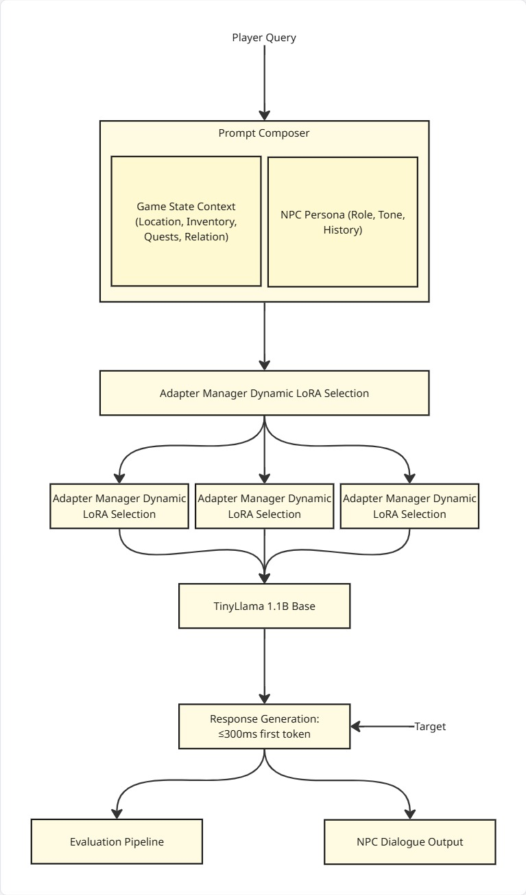

# Domain-Adaptive Lightweight NPC AI Framework
### LoRA-Adapted Small Language Models for Persona-Stable, Runtime-Switchable Game NPC Dialogue

> **Final Year Research Project** · IEEE Conference on Games (CoG) Track
> Department of Computer Science

---

## Overview

NPC dialogue systems fall into two failure modes: large cloud-hosted models (GPT-4o, Claude) give good quality but are too slow, expensive, and offline-incompatible for consumer game hardware; scripted dialogue trees are fast and cheap but brittle — any input outside the script collapses the persona immediately.

This project builds a framework around **small (sub-2B) base language models** with per-archetype **LoRA persona adapters** swapped at runtime with no full model reload. Two base models are benchmarked side by side — **TinyLlama-1.1B** and **Qwen3-0.6B** — to support a generalizability claim and to add a parameter-count axis to the drift metrics (see [Base Models](#base-models)). The research domain is a **modern city** setting.

The core research object is *persona drift* and, specifically, *epistemic* persona drift — whether an NPC leaks knowledge outside what its character is permitted to know. The framework measures this per-turn, judge-free, on the same consumer hardware that serves the game.

Full specification, schema, and roadmap: `DevFiles/Specs.md`. Task tracking: [`Docs/TODO.md`](Docs/TODO.md). Data pipeline docs: [`Docs/DATA_PIPELINE.md`](Docs/DATA_PIPELINE.md). Related work and differentiation: [`Docs/RELATED_WORK.md`](Docs/RELATED_WORK.md).

---

## Research Contributions

| # | Contribution | Type |
|---|--------------|------|
| **C1** | **Knowledge Boundary Drift (KBD)** — a judge-free, per-turn metric for *epistemic* persona violation. Each world-state knowledge item and each adapter carries a **visibility set**; KBD measures the fraction of factual references in a response that fall outside the active adapter's visibility set. Automatic, cheap enough to run per-turn at inference, and attributable to a specific knowledge source. | Novel metric |
| **C2** | **Persona interpolation and the α-sweep** — LoRA weight merging (`W_blend = α·W_A + (1-α)·W_B`) is *not* claimed as a technique (it is standard). The novel claim is the research question: when two persona adapters are interpolated, does the **epistemic boundary** interpolate, or collapse to the union of both parents' knowledge? Measured via KBD + PDM v2 across α ∈ {0, 0.25, 0.5, 0.75, 1.0}. | Novel analysis |
| **C3** | **Modern-city NPC dialogue dataset** — 960 pairs across 8 roles (police officer 325, pharmacist 140, professor 120, shopkeeper/bartender/social worker/executive/service worker 75 each), persona re-voiced from cleared source corpora plus hand-authored refusal/contrastive-confirm examples, with visibility sets (`knowledge_base.json`) annotated per fact. | Dataset |

## Research Questions

| ID | Question |
|----|----------|
| RQ1 | Can epistemic persona violation be measured **per-turn, judge-free, and attributed to a specific knowledge source** (KBD), rather than via an opinion score from a judge model? |
| RQ2 | When two persona adapters are interpolated at ratio α, does the **epistemic boundary interpolate** (each parent's facts known with reduced confidence) or **collapse to the union** (both parents' facts fully known — a leak)? |
| RQ3 | Does a **domain-agnostic** drift metric (PDM v2) reveal multi-turn persona degradation in modern-city NPC dialogue, where a lexicon-specific metric produces no signal? |
| RQ4 | Can a two-base-model (TinyLlama-1.1B, Qwen3-0.6B) LoRA framework serve persona-stable NPC dialogue under real-time latency (<500ms) on consumer hardware via llama.cpp/GGUF, and how does base model and parameter count affect drift? |

---

## Domain

**Modern city** — police officer, shopkeeper, professor, bartender, social worker, pharmacist, executive, service worker. All novel contributions (KBD, α-sweep, PDM v2) are designed and validated here. 600-pair target.

> **Scope note (2026-08-08):** an earlier design ran modern-city alongside a medieval-fantasy set as a control condition (dataset, adapters, and eval results already exist for it — see `Docs/TODO.md`). The project is now **modern-city only**; the medieval work is kept on disk but out of scope, not deleted.

Healthcare and education domains from the original proposal are **cut**.

---

## Base Models

Both base models are Apache 2.0, so public release of adapters is unaffected.

| Model | Template | Notes |
|-------|----------|-------|
| **TinyLlama-1.1B-Chat** | Llama chat | Retained from the original design; also the base benchmarked by the closest prior work (arXiv:2511.10277). |
| **Qwen3-0.6B-Base** and **Qwen3-0.6B-Instruct** | ChatML | Added as a second base. Dataset formatting and any tokenizer-dependent metric code must handle both templates. Set `enable_thinking=False` (dual-mode thinking otherwise leaks reasoning traces into generations, inflates latency, and pollutes metric scoring). Train both Base and Instruct for ≥1 archetype: the Instruct "helpful assistant" prior competes with the NPC persona — that competition is itself a drift mechanism, reported as an ablation. |

LoRA config (both models): `r=16`, `alpha=32`, target `q_proj, k_proj, v_proj, o_proj, gate_proj, up_proj, down_proj`.

Inference path moved to **llama.cpp / GGUF Q4_K_M**. The previously recorded 3486 ms baseline latency reflected an unoptimized inference path — re-measured (`evaluation/run_benchmarks.py`, real `psutil` peak-RSS + wall-clock latency, not estimated): stock TinyLlama baseline **1348.6 ms**, police-officer adapter **588.9 ms** (2.3× faster than baseline — LoRA-adapted generation is *not* slower than the unadapted model here). Peak RSS ~1062 MB for both conditions; adapter storage 668.8 MB GGUF + 25.3 MB adapter (`r=16`, 7-module config — ~11× larger than the archived `r=8`/2-module medieval config's 2.3 MB, not directly comparable).

---

## Architecture



```
Player input ──▶ FastAPI backend ──▶ Adapter routing (archetype classification)
                                              │
              TinyLlama-1.1B / Qwen3-0.6B base (always loaded)
                          + swapped/interpolated LoRA persona adapter
                          + per-adapter visibility set
                                              │
              KBD scorer · PDM v2 scorer · BERTScore · Latency Logger
                          (llama.cpp / GGUF Q4_K_M serving)
```

Request flow, adapter interpolation flow, and full component breakdown: see `Specs.md`.

---

## Evaluation

Four comparison conditions measured per metric:

| Condition | Description |
|-----------|-------------|
| A | Base model, no adapter (floor) |
| B | Base + persona adapter (primary claim) |
| C | Base + **flat-RAG at matched token budget** (essential — without it, a reviewer attributes gains to shorter prompts rather than to visibility structure) |
| D | GPT-4o few-shot (upper-bound reference) |

| Metric | Tool | Status |
|--------|------|--------|
| KBD (Knowledge Boundary Drift) | Custom Python (calibrated on real generations, weeks 5–6) | Done — full 8-archetype coverage. Forbidden-probe violation 9/16 (56%) overall; tracks refusal-training history closely (untrained archetypes ≈50–100%, refusal-trained ones 0–25%). |
| PDM v2 (Persona Drift Metric) | Custom Python — domain-agnostic feature families | Done — 8/8 archetypes confirm trained adapters drift less than stock baseline (mean gap +0.048 to +0.086). |
| BERTScore F1 | `bert-score` (roberta-large) | Done — 8/8 archetypes, adapter beats baseline every time (overall 0.853 → 0.905, gap +0.023 to +0.068). Cleanest, most consistent result in the suite. |
| Adapter routing accuracy | Lexicon-based archetype classifier vs. player input (judge-free, TF-IDF over an 80/20 train/test split) | Done — **47.4%** (91/192 held-out), well below the >95% figure originally assumed below. Root cause: player-side utterances are largely archetype-generic ("can you tell me how to get to X?" fits any NPC) — the archetype-distinctive signal lives in the *output* voice, which is what PDM v2 already scores, not in input phrasing. See the correction note directly below. |
| Response latency | Python `time` (GGUF serving) | Done — see [Base Models](#base-models) for real numbers. |
| Peak RAM | `psutil`, sampled continuously through load + generation | Done. |
| Adapter storage | `os.path.getsize()` | Done. |

**Correction (2026-08-15):** the line below originally proposed adapter-routing accuracy as the answer to any departmental rubric requiring a >95% figure, estimating "realistically 95–99%." The real, measured number is 47.4% — that estimate was wrong, not a rounding gap. **Output schema conformance (97–100%) is the correct answer for a >95% rubric requirement instead**; adapter routing accuracy is reported honestly as a real, if weak, result, not repurposed as the headline accuracy figure. A PDM or KBD threshold pass-rate is still *not* reported as "accuracy" — the threshold would be chosen post hoc.

**Condition D (GPT-4o few-shot) has not been run** — Conditions A/B/C all have real results; D remains open.

**Human evaluation is cut.** The project reports automatic metrics only; the absence of a human study is recorded as a stated limitation.

---

## Tech Stack

| Layer | Tool |
|-------|------|
| Base models | TinyLlama-1.1B-Chat · Qwen3-0.6B (Base + Instruct) |
| Fine-tuning | HuggingFace PEFT + LoRA (r=16, α=32) |
| Training | TRL SFTTrainer + PyTorch |
| Inference | llama.cpp / GGUF Q4_K_M |
| Backend | FastAPI + Python |
| Frontend | React + Next.js (demo UI) |
| Metrics | KBD, PDM v2 (custom Python) · BERTScore |
| Tracking | Weights & Biases |

---

## Dataset

Schema — archetype, disposition, social class, context, `persona_features[]` (PDM v2 reference set), visibility set, intent, and per-entry `provenance`. Full schema: `Specs.md`.

**Modern city: 960 pairs** in `data/processed/modern_npc_dataset.json` — 600 extracted from SODA (speaker-role matched, CC BY 4.0), a hand-authored police-officer pilot, a 300-entry police top-up, and hand-authored refusal-training + contrastive-confirm examples added while closing the KBD epistemic-boundary gap (see `Docs/TODO.md` Week 6 follow-ups). Provenance recorded per entry. `knowledge_base.json` provides flat archetype visibility sets (set intersection, not a tree/graph) for all 8 archetypes. **Dataset freeze: 6 September 2026** — full sourcing detail in [`Docs/DATA_PIPELINE.md`](Docs/DATA_PIPELINE.md).

> **Why not thousands:** Andreasen & Esterle (arXiv:2511.10277) found LoRA fine-tuning on a curated ~115-pair set outperformed a ~564-pair synthetic set on factuality, context retention, and fluency, attributing the gap to dataset quality and overfitting. Small and curated is a defensible methodological choice, not a compromise.

The originally planned **stress-test corpus** extension (planted forbidden facts for KBD) targeted the archived medieval-domain file and is superseded: KBD's actual "planted forbidden fact" probes live in `data/processed/knowledge_base.json` + `kbd_probes.json` + `kbd_alpha_sweep_probes.json` (56 probes, all 8 archetypes covered), built directly for the modern domain instead.

Pipeline scripts, source-dataset licensing, and rejected datasets: [`Docs/DATA_PIPELINE.md`](Docs/DATA_PIPELINE.md).

---

## Related Work

The closest prior work is **Andreasen & Esterle, *Fixed-Persona SLMs with Modular Memory* (arXiv:2511.10277)** — TinyLlama-1.1B + LoRA personas + runtime-swappable modules + consumer-hardware benchmarks. They swap *memory stores* with persona fixed in weights; this project swaps *persona adapters and visibility sets*, adds a judge-free drift metric (KBD), and analyses multi-turn degradation and α-interpolation. This project is positioned as a direct extension of that work rather than a collision with it.

Full nine-paper differentiation table (Wang et al. LoRA fusion, Buakhaw et al. *Deflanderization*, Liu/Xie/Jiang, McGrath et al. *Echoes of Others*, Nuriyev, Kim et al. *MART*, Tódová, and one IEEE paper): [`Docs/RELATED_WORK.md`](Docs/RELATED_WORK.md). 8 of 9 source PDFs are archived locally under `Base Papers/`; the IEEE paper (arnumber 11419836) remains inaccessible behind a JS-gated paywall as of 2026-08-15 — still an open item.

Note: "persona drift" is an established named phenomenon with existing quantitative metrics (C-Score, NLI-entailment consistency, activation-space measures). PDM v2's and KBD's claim is **judge-free per-turn cheapness and source attribution**, not discovery of the phenomenon.

### Base Papers

**[1] Large Language Models and Games: A Survey and Roadmap** — Gallotta et al., arXiv:2402.18659 (2024). Identifies lightweight, locally deployable NPC dialogue as an open research direction.

**[2] Generating Role-Playing Game Quests With GPT Language Models** — Värtinen, Hämäläinen, Guckelsberger — IEEE ToG 16(1) (2024). Identifies entity consistency and contextual coherence as unsolved problems in game-specific NLP.

---

## Project Status

- [x] Proposal + specification finalized (`DevFiles/Specs.md`)
- [x] Literature review + related-work differentiation ([`Docs/RELATED_WORK.md`](Docs/RELATED_WORK.md)) — 8 of 9 source PDFs archived locally
- [x] Data pipeline scaffolded; earlier medieval-fantasy set (1,003 pairs, validated) kept on disk, out of scope as of the 2026-08-08 modern-only decision
- [x] Framework/systems scaffolding: `AdapterManager` (runtime adapter swap), `blend_adapters.py`, training pipeline, FastAPI backend, Next.js demo — all domain-agnostic
- [x] llama.cpp/GGUF inference path; TinyLlama latency re-measured (1348.6ms baseline vs 588.9ms adapter, real numbers not estimated)
- [x] Modern-city dataset — 960 pairs, all 8 archetypes covered (not frozen yet, still growing via the KBD-fix follow-ups; **freeze 6 Sep 2026**)
- [x] PDM v2 (domain-agnostic) calibrated on real generations — 8/8 archetypes confirm the trained-adapter-drifts-less finding
- [x] KBD implementation + full probe coverage (56 probes, all 8 archetypes, `knowledge_base.json`-based, not the originally planned stress-corpus route)
- [x] Train 8 modern adapters × TinyLlama-1.1B — all merged, GGUF-quantized, individually verified
- [x] α-sweep (KBD + PDM v2) for 3 adapter pairs — **headline result exists**: collapse-to-union is the dominant behavior, not clean interpolation (strengthened after doubling probe count 2026-08-15)
- [x] Flat-RAG baseline (Condition C, matched token budget) — done for all 3 pairs, rerun after the KBD-fix retrains; latency/RAM/storage benchmarks and 2 figures built and cross-verified
- [x] BERTScore F1 and adapter-routing accuracy — both closed 2026-08-15 (see [Evaluation](#evaluation))
- [ ] Qwen3-0.6B (Base + Instruct) — still parked, not started; needed for RQ4 specifically, not for RQ2's blending question
- [ ] Condition D (GPT-4o few-shot) — not yet run
- [ ] Paper draft — not started; results still being generated

**Results freeze: Friday 23 October 2026** — no new experiments after this date, writing only.

Detailed week-by-week schedule: [`Docs/TODO.md`](Docs/TODO.md).

---

## Publication Target

**Primary:** IEEE Conference on Games (CoG)
**Backup:** ACM FDG · IEEE Access · ArXiv preprint
**Submission deadline:** mid-November 2026

---

## Team

### Mentor
**Mr. K. Sudhakar**
AP/CSE · Kongu Engineering College

### Developer
**Yugabharathi J**
Final Year Student · B.E. CSE · Kongu Engineering College
*Solo developer.*

---

*Built on open-source tools (TinyLlama and Qwen3 base models are Apache 2.0). Dataset and adapter weights will be released publicly upon paper submission.*
